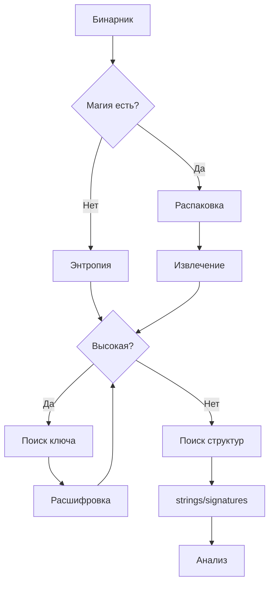

## Пайплайн

## Правила

1. Никогда не модифицировать оригинальный файл — работать с копией
2. Каждый шаг документировать: что делали, что нашли
3. Если застрял — проверить предположения: может файл не то чем кажется
4. Искать известные паттерны — вероятно кто-то уже делал похожее
5. Проверять little/big endian — частая ошибка

## Распространённые ловушки
- Файл зашифрован → расшифрован → ещё раз зашифрован (multi-layer)
- Подпись подделана под другой формат
- Первые 100 байт — заголовок, всё остальное — данные в другом формате
- Xor-ключ может быть в самом файле (перед данными или после)
